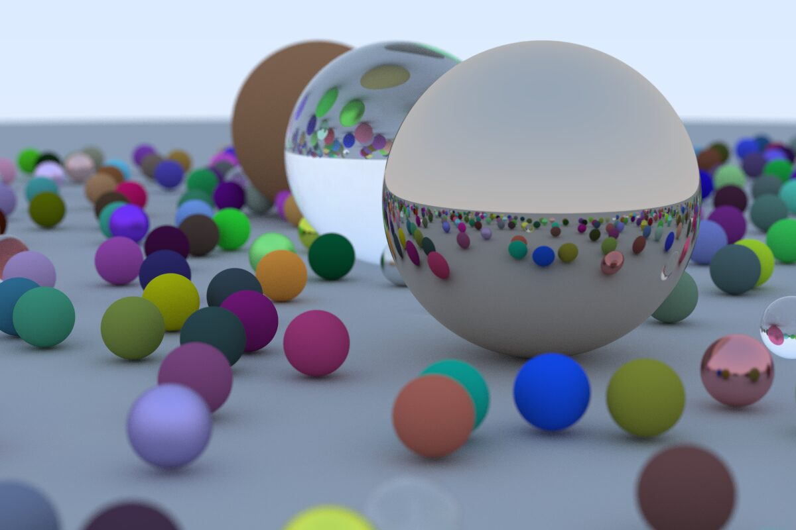

# Raytracer

Learning raytracing with [Ray Tracing In One Week Series](https://github.com/RayTracing/raytracing.github.io).

1. [_Ray Tracing in One Weekend_](https://raytracing.github.io/books/RayTracingInOneWeekend.html)
1. [_Ray Tracing: The Next Week_](https://raytracing.github.io/books/RayTracingTheNextWeek.html)

## Development

```shell
cargo build
```

## Run

```shell
cargo run > image.ppm

# To render the two spheres scene, please use release build.
# btw, still slow for now :(
cargo run --release > image.ppm
```

## Showcase


